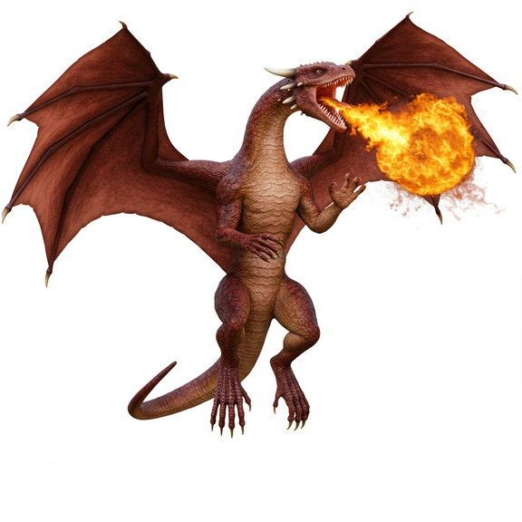
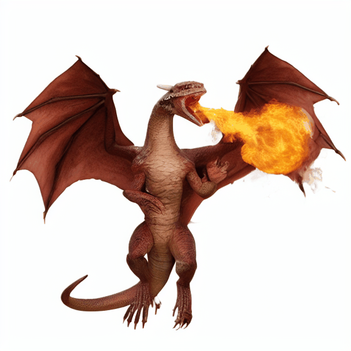
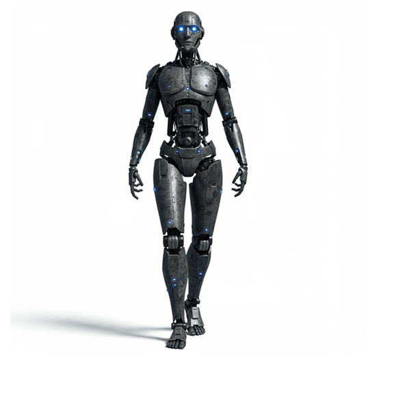
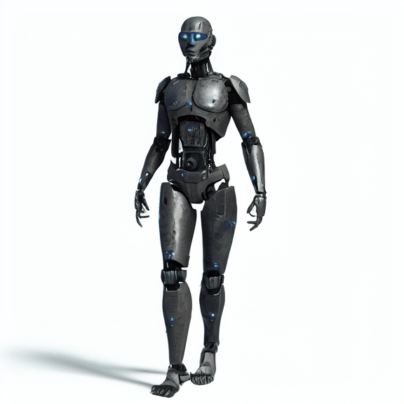
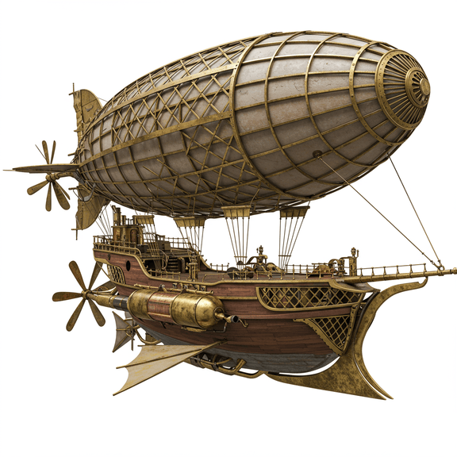
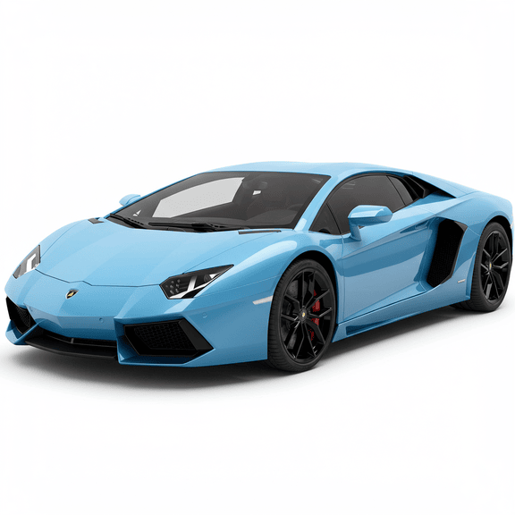
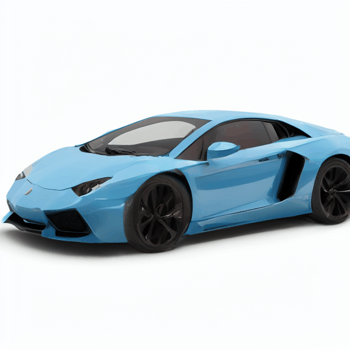

# Build 3D visuals of objects using Imagen 3 and Stable Video 3D.
This repository implements the creation of 3D visualizations of objects using Stable Video 3D (SV3D) from creative images generated with Imagen 3.

----

### Results:

| Prompt        | Imagen 3 Output       | SV3D Output         |
|--------------|----------------------|----------------------|
| A flying red dragon, spitting fire | 

 | 

 |
| A humanoid robot with metallic armour, glowing blue eyes |  |  |
| A steampunk airship floating against a plain white background |  |  |
| A light blue Lamborghini|  |  |

